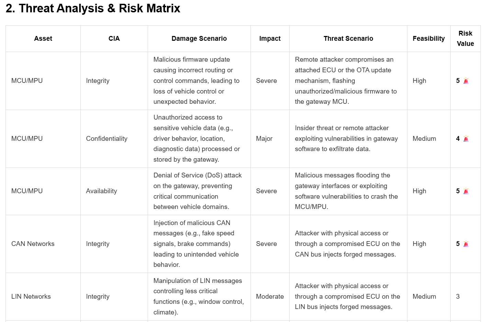

# Automated ISO/SAE 21434 TARA Agent

**Created by Komuraiah Poodari, CISSP**

A multi-modal AI agent built on Google's Agent Development Kit (ADK), Vertex AI environment, and Gemini 2.5 Flash, designed to automate Threat Analysis and Risk Assessments (TARA) for automotive cyber-physical systems. This version is at a Proof-of-Concept (POC) stage.

## 🎯 Project Overview

The **Automated Threat Analysis and Risk Assessment (TARA) Agent** accelerates the automotive cybersecurity lifecycle by analyzing E/E architecture block diagrams and generating **ISO/SAE 21434** standard-aligned, audit-ready threat models. 

By leveraging Google ADK native multi-modal capabilities, this agent eliminates the manual bottleneck of parsing Bills of Materials (BoM) and calculating risk vectors, reducing a weeks-long engineering process down to minutes/hours.

### Key Features

- 👁️ **Multi-modal Ingestion**: Natively processes PDFs, images (e.g., NXP/Texas Instruments block diagrams), or raw text descriptions.
- 🧩 **Automated BoM Extraction**: Visually identifies physical components (MCUs, PMICs) and logical networks (CAN-FD, Automotive Ethernet).
- 🧠 **Chain of Thought (CoT) Reasoning**: Provides explicit, auditable rationales for every Impact and Feasibility score to satisfy compliance audits.
- 🛡️ **Actionable Engineering Controls**: Maps high-risk threat scenarios to specific technical requirements (e.g., SecOC, MACsec, UWB distance bounding).
- 📊 **Dual-Format Output**: Automatically generates human-readable Markdown reports for review and machine-readable JSON payloads for direct MBSE/Jira ingestion.
- 🚀 **Built on Google ADK and Vertex AI environment**: Utilizing standard Python function calling for reliable, local file-system integration.

---

## 📁 Project Folder Structure

```text
Agent-based-TARA/
├── README.md                      # Project documentation
├── .env                           # GDK environment
├── __init__.py                    # Initialization file
├── agent.py                       # Main TARA orchestrator and tool definitions
├── tara_output.json               # Machine-readable artifact (auto-generated)
└── tara_report.md                 # Human-readable audit report (auto-generated)
```

### File Descriptions

| File | Purpose |
|------|---------|
| **__init__.py** | Simple initialization file to import custom agent for ADK |
| **config.py** | Contains the system prompt instructions, Chain of Thought constraints, and the custom Python tool for output (JSON and markdown files) generation |
| **tara_output.json** | The strict JSON payload containing the BoM, TARA matrix, Security Goals, and Requirements. Ready for MBSE integration. |
| **tara_report.md** |  A formatted, highly scannable Markdown report with conditional logic (e.g., highlighting Risk Values of 4 or 5). |

---

## 🏗️ Agent Architecture

The system uses a constrained, single-agent architecture optimized for deterministic 
output and local tool execution:

```

┌─────────────────────────────────────────────────────────────────┐
│                    Input Ingestion                              │
│         (PDF Block Diagram, Image, or Text Prompt)              │
└──────────────────────┬──────────────────────────────────────────┘
                       │
                       ▼
            ┌──────────────────────┐
            │    TARA Analyst      │
            │  (Core Logic Engine) │
            │                      │
            │ Model: Gemini 2.5-   │
            │        Flash         │
            │ Task: ISO/SAE 21434  │
            └──────────┬───────────┘
                       │
                       │ 1. Extracts BoM visually
                       │ 2. Computes CIA/SFOP Impact
                       │ 3. Applies CoT Rationale
                       ▼
            ┌──────────────────────┐
            │   Tool Execution     │
            │(save_tara_artifacts) │
            └──────────┬───────────┘
                       │
           ┌───────────┴───────────┐
           ▼                       ▼
   [tara_report.md]        [tara_output.json]
   (Human Review)          (MBSE Pipeline for future enhancement)
            └──────────────────────┘
```

## 🔧 Tools
```
save_tara_artifacts(json_payload: str)
```
A custom Python function natively bound to the ADK agent. It receives the massive JSON payload generated by the LLM in memory, parses it, and safely writes both the .json and formatted .md files to the local disk. This allows the agent to interact directly with the development environment without user copy-pasting.


## 🔄 Workflow
**1. Upload**: A systems engineer uploads an E/E architecture PDF to the ADK web interface.

**2. Vision Parsing**: The model "reads" the diagram, extracting components like the processor, network interfaces, or logical functional blocks.

**3. Threat Modeling**: The agent maps known automotive attack vectors (e.g., Remote OTA compromise, CAN spoofing) to the identified BoM.

**4. CoT Scoring**: The model calculates Risk Values (1-5) and documents the exact engineering rationale for the score using chain of thought(COT).

**5. Tool Trigger**: The agent automatically calls the Python script to save the files locally.


## 🚀 Getting Started

### Prerequisites

- Python 3.10+
- Google Cloud Account with Vertex AI access
- Required libraries: `google-adk`

---

### Installation
```
1. git clone https://github.com/komer/tara.git)
2. source .venv/bin/activate  #in the parent directory
3. pip install google-adk
```

## 💬 Example Execution: NXP Digital Key

### Scenario: Multi-modal Ingestion of a Smart Access Architecture
**Input:** A PDF block diagram of the NXP Digital Key Reference System (CCC/ICCE/ICCOA).
**Prompt:** "Perform a full TARA and generate security requirements based on this uploaded architecture diagram."

**Output Snippet (Chain of Thought in Action):**
*The agent successfully identified the Secure Element (NCJ38x) and accurately calculated its risk profile by reasoning through the attack feasibility:*

> **Asset:** Vehicle - Inside - Access ECU - Secure Element (NCJ38x)
> **Threat Scenario:** Invasive or semi-invasive physical attack (e.g., micro-probing, fault injection) on the Secure Element.
> **Impact:** Severe
> * **Impact Rationale:** *Direct compromise of the root of trust, leading to unauthorized vehicle access/start, potentially endangering occupants. Complete system bypass.*
> **Feasibility:** Low
> * **Feasibility Rationale:** *Requires highly specialized and expensive equipment, significant expertise in chip reverse engineering and fault injection techniques, and physical access to the chip itself.*
> **Risk Value:** 3

*(Here is the output from the agent:)*


---

## 📦 Configuration

The agent's parameters can be modified directly in the `tara/agent.py` file. 

To change the underlying reasoning engine or adjust constraints:
```python
root_agent = Agent(
    name='tara_analyst',
    model='gemini-2.5-flash', # Can be upgraded to 'gemini-2.5-pro' for deeper reasoning
    # ...
)
```
## 🧪 Testing
To run a regression test and verify the local tool execution pipeline without uploading a document, you can paste a text-based architecture description directly into the ADK chat interface:
```
Target: Automotive PEPS System
Components: NXP PCF7953 Fob MCU, 125kHz LF Antenna, 433MHz UHF Transmitter, S32K144 SKM MCU.
Perform a full ISO 21434 TARA.
```

## 📄 License

Licensed under the Apache License 2.0. See LICENSE file for details.

---

## 🤝 Contributing

1. Contributions to improve the agent's architectural recognition or ISO/SAE 21434 compliance logic are welcome!

2. Fork the repository

3. Create a feature branch (git checkout -b feature/enhanced-cot-logic)

5. Commit your changes (git commit -m 'Add detailed SecOC requirement rationale')

6. Push to the branch (git push origin feature/enhanced-cot-logic)

7. Open a Pull Request

---

## 📚 References
1. ISO/SAE 21434: Road vehicles — Cybersecurity engineering

2. Google Agent Development Kit (ADK)

3. Gemini Multi-modal API Documentation


## ⚠️ Disclaimer

This tool is a Proof of Concept (POC) designed to accelerate the threat modeling process. LLMs are probabilistic systems. All AI-generated Threat Analysis and Risk Assessments (TARAs), Security Goals, and Engineering Requirements must be rigorously reviewed and verified by a qualified Human-in-the-Loop (HITL) before being applied to safety-critical cyber-physical systems. This tool shall not be used for production system assessments. It is work-in-progress.