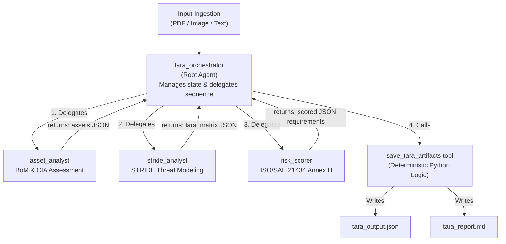

# Agentic-TARA: Multi-modal AI for ISO/SAE 21434 Compliance

**Created by Komuraiah Poodari, CISSP**

A multi-modal AI agent built on Google's Agent Development Kit (ADK), Vertex AI environment, and Gemini 2.5 Flash, designed to automate Threat Analysis and Risk Assessments (TARA) for automotive cyber-physical systems. This version is a Proof-of-Concept (POC).

## 🎯 Project Overview

The **Automated Threat Analysis and Risk Assessment (TARA) Agent** accelerates the automotive cybersecurity lifecycle by analyzing E/E architecture block diagrams and generating **ISO/SAE 21434** standard-aligned, audit-ready threat models. Unlike standard LLM implementations, this project uses a **hybrid AI-Deterministic approach**:

The goal is to compress time and resources required for TARA by leveraging Google ADK native multi-modal capabilities. This agent eliminates the manual bottleneck of parsing Bills of Materials (BoM) and calculating risk vectors, reducing a weeks-long engineering process down to hours.
* The AI conducts the threat analysis and risk assessment (TARA) based on the instructions provided by the developer.
* The model determines the impact and feasibility ratings.
* The model maps the (asset damage impact rating, feasibility rating) to risk based on ISO/SAE 21434 Annex H. guidance.
* The prescribes security goals and security requirements (engineering controls).


### Key Features

- 👁️ **Multi-modal Ingestion**: Natively processes PDFs, images (e.g., NXP/Texas Instruments block diagrams), or raw text descriptions.
- 🧩 **Automated BoM Extraction**: Visually identifies physical components (MCUs, PMICs) and logical networks (CAN-FD, Automotive Ethernet).
- 🧠 **Chain of Thought (CoT) Reasoning**: Provides explicit, auditable rationales for every Impact and Feasibility score to satisfy compliance audits.
- 🛡️ **Actionable Engineering Controls**: Maps high-risk threat scenarios to specific technical requirements (e.g., SecOC, MACsec, UWB distance bounding).
- 📊 **Dual-Format Output**: Automatically generates human-readable Markdown reports for review and machine-readable JSON payloads for direct MBSE/Jira ingestion.
- 🚀 **Built on Google ADK and Vertex AI environment**: Utilizing standard Python function calling for reliable, local file-system integration.
- 🧠 **STRIDE Threat Modeling**: Every threat scenario is categorized to ensure coverage of Spoofing, Tampering, Repudiation, Info Disclosure, DoS, and Elevation of Privilege.

- 🔝 **Maximum Impact Principle**: Automatically evaluates SFOP (Safety, Financial, Operational, Privacy) and bases the TARA on the highest identified impact level.

---

## Methodology & Standards
### 1. Threat Identification (STRIDE)
The agent uses the STRIDE framework to analyze each asset in the Bill of Materials. This ensures that the generated scenarios meet the requirements for "Threat Scenario Identification" as per ISO 21434 Section 15.
### 2. Risk Determination (Annex H)
To prevent "AI Hallucinations" in safety-critical scoring, the agent passes its findings to a deterministic Python function that enforces the standard risk matrix:


| Impact \ Feasibility | Very Low | Low | Medium | High |
| :--- | :--- | :--- | :--- | :--- |
| Severe | 2 | 3 | 4 | 5 |
| Major | 1 | 2 | 3 | 4 |
| Moderate | 1 | 2 | 2 | 3 |
| Negligible | 1 | 1 | 1 | 1 |

### 3. Feasibility Analysis (Annex G)
Attack feasibility also considers the Attack Vector (Network, Adjacent, Local, Physical).

## 📁 Project Folder Structure

```text
Agent-based-TARA/
├── README.md                      # Project documentation
├── .env                           # GDK environment
├── agent.py                       # Main TARA orchestrator
├── agents/                        # Specialized sub-agents (asset_analyst, stride_analyst, risk_scorer)
├── tools/                         # Custom tools (artifacts generation)
├── tara_output.json               # Auto-generated machine-readable artifact
└── tara_report.md                 # Auto-generated human-readable audit report
```

### File Descriptions

| File/Folder | Purpose |
|-------------|---------|
| **agent.py** | The root `tara_orchestrator` that delegates tasks to sub-agents and manages state. |
| **agents/** | Contains specialist sub-agents in correponding files: `asset_analyst`, `stride_analyst`, and `risk_scorer`. |
| **tools/** | Contains the deterministic `save_tara_artifacts` tool for writing structured outputs. The file is `artifacts.py`. |
| **tara_output.json** | The strict JSON payload containing the BoM, TARA matrix, Goals, and Requirements. |
| **tara_report.md** |  A formatted, highly scannable Markdown report with conditional logic. |

---

## 🏗️ Agent Architecture

The system uses a **Hierarchical Multi-Agent Architecture** optimized for complex orchestration and localized tool execution:



## 🔧 Tools
```
save_tara_artifacts(json_payload: str)
```
A custom Python function natively bound to the ADK agent. It receives the JSON payload generated by the LLM in memory, parses it, and safely writes both the .json and formatted .md files to the local disk. This allows the agent to interact directly with the development environment without user copy-pasting.


## 🔄 Workflow
**1. Upload**: A systems engineer uploads an E/E architecture PDF to the ADK web interface.

**2. Vision Parsing**: The agent `asset_analyst` "reads" the diagram and extracts components like the processor, network interfaces, or logical functional blocks.

**3. Threat Modeling**: The agent maps known automotive attack vectors (e.g., Remote OTA compromise, CAN spoofing) to the identified BoM.

**4. CoT Scoring**: The model calculates Risk Values (1-5) and documents the exact engineering rationale for the score using chain of thought(COT).

**5. Tool Trigger**: The root agent `tara_orchestrator` automatically calls the Python script to save the files locally.


## 🚀 Getting Started

### Prerequisites

- Python 3.10+ (developed and tested on 3.12)
- Google Cloud Account with Vertex AI access
- Required libraries: `google-adk`

---

### Installation
```
1. git clone https://github.com/komer/tara.git)
2. source .venv/bin/activate  #in the parent directory
3. pip install google-adk
```

## 💬 Example Execution: NXP Gateway reference platform

### Scenario: Multi-modal Ingestion of an Automotive Gateway Architecture
**Input:** A PDF block diagram of the NXP Gateway reference platform with introduction and architecture block diagram
**Prompt:** "Perform a full TARA and generate security requirements based on this uploaded architecture diagram."


## 📊 Sample Output (abridged)

### Threat Analysis & Risk Matrix with STRIDE
| Asset | CIA | Damage Scenario | Impact | Impact Rationale | Threat Scenario | Feasibility | Feasibility Rationale | Risk |
|---|---|---|---|---|---|---|---|---|
| MCU/MPU | Confidentiality, Integrity, Availability | An attacker gains control of the MCU/MPU, executing malicious code that leads to unintended vehicle behavior (e.g., sudden braking, acceleration, or steering issues) or exfiltrating sensitive internal data and cryptographic keys. | Severe | *Safety impact dominates: Compromise of the core processing unit can lead to loss of vehicle control, resulting in severe injury or fatality. Operational impact is also severe, as the vehicle becomes unsafe or inoperable. (Category: S, O)* | An attacker exploits a firmware vulnerability (e.g., buffer overflow, insecure diagnostic interface) on the MCU/MPU via a diagnostic port or a remotely exploitable connected interface (e.g., infotainment, telematics unit). This allows them to inject and execute arbitrary code with elevated privileges. | Medium | *Requires significant expertise in embedded systems, reverse engineering, and exploit development for the specific MCU architecture. Access can range from local (diagnostic port) to remote (via network). The primary STRIDE threats are Tampering and Denial of Service, with potential Information Disclosure. (STRIDE: Tampering, Denial of Service, Information Disclosure)* | **4** 🚨 |
| Ethernet Switch | Confidentiality, Integrity, Availability | An attacker reconfigures the Ethernet switch, allowing unauthorized traffic between isolated network segments (e.g., exposing ADAS data to infotainment), performing a denial of service by blocking critical traffic, or corrupting routing tables, leading to system failure or data leakage. | Severe | *Safety impact dominates: Disruption of critical ADAS or vehicle control data paths can directly lead to accidents. Privacy impact is also severe due to unauthorized data disclosure. Operational impact is high due to network segmentation breach. (Category: S, P, O)* | An attacker exploits a vulnerability in the switch's management interface (e.g., SNMP, Web GUI, or via a compromised connected ECU) to reprogram its forwarding rules, VLAN configurations, or Quality of Service (QoS) settings. This can lead to traffic redirection, data exfiltration, or a denial of service for connected ECUs. | Medium | *Requires gaining access to the switch's management plane, either via a compromised adjacent ECU or a direct remote vector if exposed. Expertise in network configuration and switch vulnerabilities is needed. The primary STRIDE threats are Tampering, Information Disclosure, and Denial of Service. (STRIDE: Tampering, Information Disclosure, Denial of Service)* | **4** 🚨 |
| OTA Update Manager | Confidentiality, Integrity, Availability | An attacker introduces malicious firmware updates, corrupts legitimate updates, or causes the update process to fail, leading to permanent system damage (bricking), introduction of malware, prolonged vehicle downtime, or disclosure of sensitive intellectual property. | Severe | *Safety impact dominates: Injection of malicious firmware can lead to unsafe vehicle operation or complete loss of control. Operational impact is severe (bricking, extended downtime). Financial impact is immense due to widespread recalls, and privacy impact is high from IP disclosure. (Category: S, O, F, P)* | An attacker intercepts an OTA update package, modifies it to contain malicious code (Tampering), or substitutes it with an entirely different malicious package (Spoofing). This could involve exploiting vulnerabilities in the update server, communication channels (e.g., insecure TLS), or the vehicle-side OTA Update Manager (e.g., insufficient signature verification, buffer overflows). A DoS attack could prevent critical security updates. (Tampering, Spoofing, Denial of Service, Information Disclosure) | Medium | *OTA update mechanisms are complex and involve multiple components (server, network, client). Exploiting vulnerabilities requires high expertise in cryptography, network protocols, and client-side software. Attacks have high scalability, making them a prime target for skilled adversaries. (STRIDE: Tampering, Spoofing, Denial of Service, Information Disclosure)* | **4** 🚨 |

## 3. Security Goals (Risk Treatment)
**Asset:** MCU/MPU
> The MCU/MPU SHALL prevent unauthorized code execution and maintain the integrity of its firmware and sensitive data.

**Asset:** Ethernet Switch
> The Ethernet switch SHALL enforce network segmentation and ensure the integrity and confidentiality of routing tables and data.

**Asset:** OTA Update Manager
> The OTA Update Manager SHALL ensure the authenticity and integrity of all firmware updates and prevent their unauthorized modification or injection.

## 4. Security Requirements (Engineering Controls)
**Maps to Goal:** The MCU/MPU SHALL prevent unauthorized code execution and maintain the integrity of its firmware and sensitive data.
* **Control:** The MCU/MPU SHALL implement a secure boot process to verify the authenticity and integrity of firmware before execution.
  * **Rationale:** *Secure boot ensures that only trusted and unaltered firmware is loaded and executed, preventing the introduction of malicious code.*

**Maps to Goal:** The Ethernet switch SHALL enforce network segmentation and ensure the integrity and confidentiality of routing tables and data.
* **Control:** The Ethernet switch SHALL support MACsec (Media Access Control Security) or similar link-layer encryption for sensitive communication paths.
  * **Rationale:** *Provides confidentiality and integrity protection for data frames, preventing eavesdropping and tampering.*

**Maps to Goal:** The OTA Update Manager SHALL ensure the authenticity and integrity of all firmware updates and prevent their unauthorized modification or injection.
* **Control:** All OTA update packages SHALL be cryptographically signed by a trusted authority and verified by the vehicle's OTA Update Manager before installation.
  * **Rationale:** *Ensures that only legitimate and untampered updates are applied.*

## 📦 Configuration

The orchestration parameters can be modified directly in the `agent.py` file. 

To change the underlying reasoning engine for the root agent:
```python
root_agent = Agent(
    name='tara_orchestrator',
    model='gemini-2.5-flash', 
    tools=[asset_analyst_tool, stride_analyst_tool, risk_scorer_tool, save_tara_artifacts]
)
```

**Customizing LLM Specialist Roles:**
Each stage of the TARA process has its own dedicated agent. You can fine-tune their individual instructions, models, and reasoning behavior by editing their respective files in the `agents/` directory:
- `agents/asset_analyst.py` (BoM Extraction)
- `agents/stride_analyst.py` (Threat Scenarios)
- `agents/risk_scorer.py` (Impact/Feasibility matrices)


## 📄 License

Licensed under the Apache License 2.0. See LICENSE file for details.

---

## 🤝 Contributing

1. Contributions to improve the agent's architectural recognition or ISO/SAE 21434 compliance logic are **highly appreciated!**

2. Fork the repository

3. Create a feature branch (git checkout -b feature/enhanced-cot-logic)

5. Commit your changes (git commit -m 'Add detailed SecOC requirement rationale')

6. Push to the branch (git push origin feature/enhanced-cot-logic)

7. Open a Pull Request

---

## 📚 References
1. ISO/SAE 21434: Road vehicles — Cybersecurity engineering

2. Google Agent Development Kit (ADK)

3. Gemini Multi-modal API Documentation


## ⚠️ Disclaimer

This tool is a **Proof of Concept (POC)** designed to accelerate the threat modeling process. LLMs are probabilistic systems. All AI-generated Threat Analysis and Risk Assessments (TARAs), Security Goals, and Engineering Requirements must be rigorously reviewed and verified by a qualified Human-in-the-Loop (HITL) before being applied to safety-critical cyber-physical systems. This tool in its current state shall not be used for production system assessments. It is a work-in-progress.